Vamos ahora a entrar a revisar en profundidad cada una de las propiedades que puede tener nuestro contenedor padre:

- display
- flex-direction
- flex-wrap
- flex-flow
- justify-content
- align-items
- align-content

Para jugar con cada una de estas propiedades vamos a crear una estructura básica de HTML que nos permita ir incluyendo las propiedades.

```html
<div class="flex-container">
        <div class="flex-item">A</div>
        <div class="flex-item">B</div>
        <div class="flex-item">C</div>
        <div class="flex-item">D</div>
        <div class="flex-item">E</div>
        <div class="flex-item">F</div>
        <div class="flex-item">G</div>
        <div class="flex-item">H</div>
        <div class="flex-item">I</div>
        <div class="flex-item">J</div>
    </div>
```

```css
.flex-container{
    background-color: plum;
}

.flex-item{
    background-color: darkorchid;
    width: 100px;
    height: 100px;
    margin: 10px;
    color: white;
}

```

### DISPLAY

Es la propiedad que define el flex container y que proporciona flexibilidad para todos los hijos directos del mismo 

 

```css
.flex-container{
    display: flex;
}
```

 


### FLEX DIRECTION

Propiedad que define el eje principal y la dirección en la que colocaremos los elementos flexibles dentro del contenedor (filas horizontales - columnas verticales)

Tenemos cuatro valores asociados al flex-direction

   

```css
.flex-container {
    flex-direction: row || column || row-reverse || column-reverse;
}
```

 

- **row**
    
    Es el valor por defecto en caso de que no incluyamos la propiedad. Alinea los elementos de izquierda a derecha en el eje horizontal.
    
    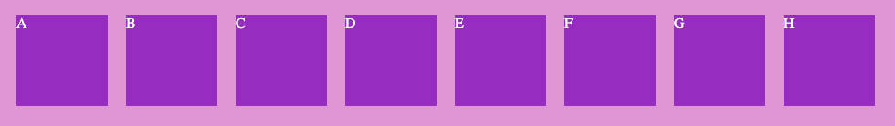
    
- **column**
    
    Alinea los elementos de arriba a abajo en el eje principal.
    
    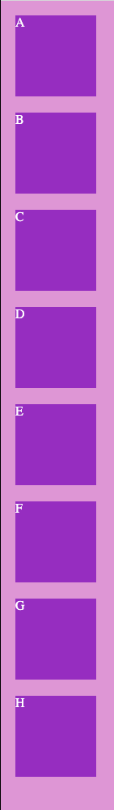
    

- **row-reverse**
    
    Mismo eje que row pero en sentido inverso, de izquierda a derecha
    
    
    

- **column-reverse**
    
    Mismo eje que column pero en sentido inverso, de abajo a arriba.
    
    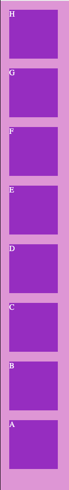
    

### FLEX-WRAP

Propiedad que indica de que manera se distribuyen los elementos en la fila y como afecta esta a su tamaño.

    

```css
.flex-container {
    flex-wrap: wrap || nowrap || wrap-reverse;
}
```

  

- **wrap**
    
    Indica que cuando no quepan más elementos a lo largo del eje ocupe otra linea.
    
    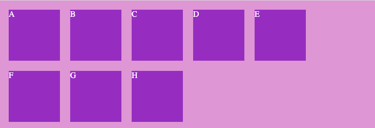
    

- **nowrap**
    
    Valor por defecto. Todos los elementos se mostrarán en una misma línea del eje principal, intentando adaptar todos a este eje. 
    

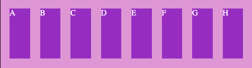

- **wrap-reverse**
    
    Igual que wrap con la diferencia de que en caso de pasar a una nueva línea, pasan de forma inversa al wrap
    
    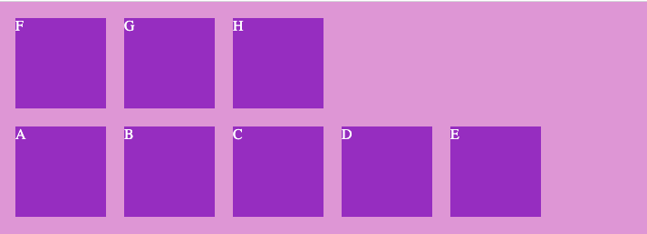
    

### FLEX-FLOW

Es la propiedad abreviada de flex-direction y flex-wrap. Por defecto con valores row y nowrap

   

```css
.flex-container {
    flex-flow: row wrap;  /* flex-flow: flex-direction flex-wrap */
}
```

  

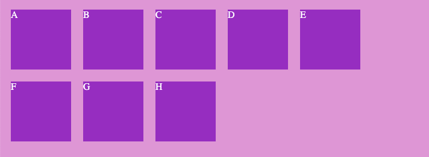

### JUSTIFY-CONTENT

La propiedad justify-content posiciona los elementos hijos en función del valor

   

```css
.flex-container {
    justify-content: flex-start || flex-end || center || space-between || space-around
}
```

  

- **flex-start**
    
    Es el valor por defecto, todos los elementos comienzan al inicio.
    
    
    
- **flex-end**
    
    Todos los elementos hijos se posicionan desde el final, el otro extremo.
    
    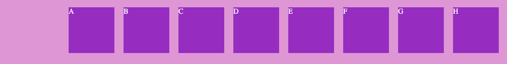
    

- **center**
    
    Los elementos se posicionan en el centro.
    
    
    

- **space-around**
    
    Distribuye el espacio de tal manera que cada hijo tenga la misma separación entre el otro.
    
    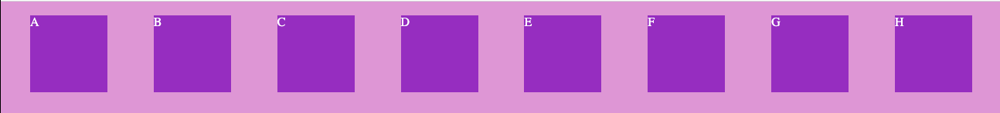
    

- **space-evenly**
    
    Distribuye el espacio libre entre todos los elementos
    
    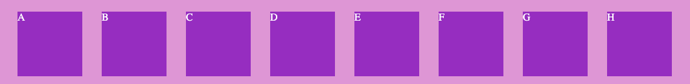
    

- **space-between**
    
    Posiciona los elementos con el mismo espacio entre cada elemento
    
    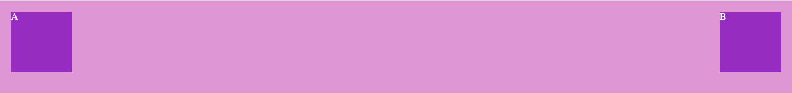
    

### ALIGN-ITEMS

Es una propiedad de alineación similar al justify-content con la diferencia que actúa sobre el eje. perpendicular.

   

```css
.flex-container {
    align-items: flex-start || flex-end || center || stretch || baseline;
}
```

  

Vamos a modificar la clase flex-container para que se vean mejor los diferentes valores:

```css
.flex-container{
    display: flex;
    height: 300px;
    border: 2px solid black;
}
```

- **flex-start**
    
    Nos sirve para posicionar los elementos al inicio del contenedor padre
    
    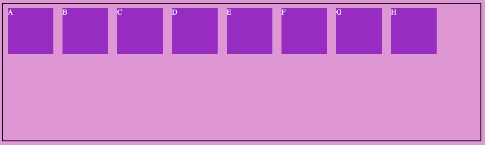
    

- **flex-end**
    
    Posiciona los elementos al final del contenedor padre
    
    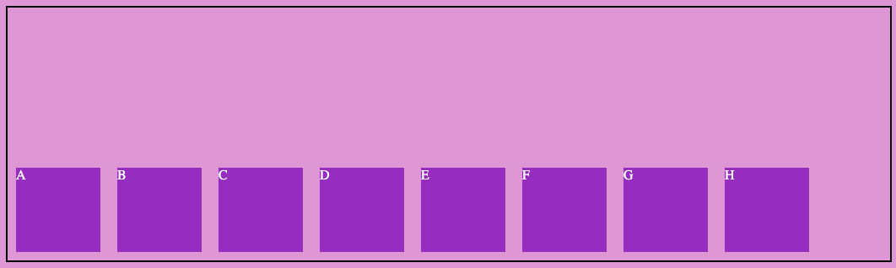
    

- **stretch**
    
    En caso de que el elemento hijo no tenga altura, strench vale para que el hijo adquiera la altura del padre
    
    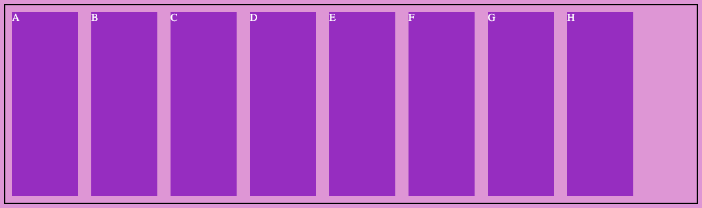
    

- **center**
    
    Para centrar los elementos a lo largo del eje
    
    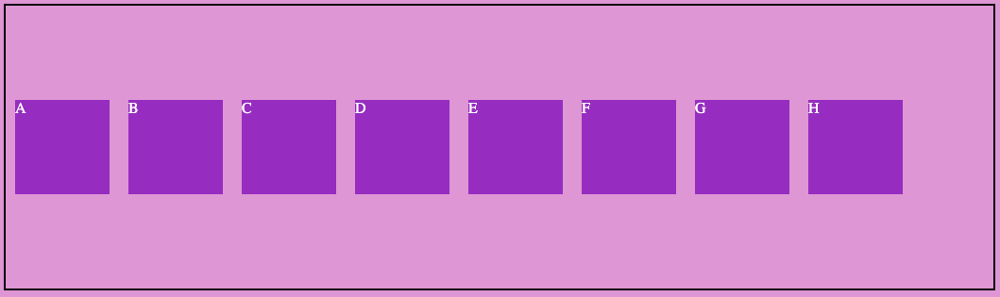
    

- **baseline**
    
    Alineados en función de las líneas base del texto.
    
    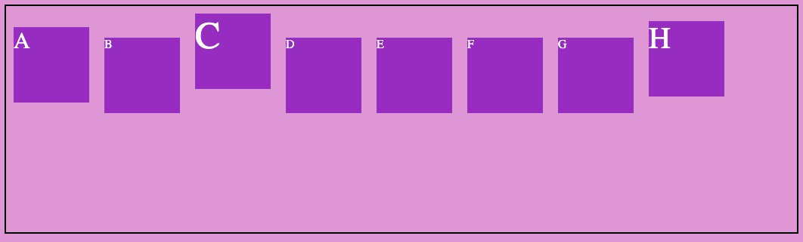
    

### ALIGN-CONTENT

Para gestionar como se alinean los elementos dentro del contenedor cuando tenemos múltiples líneas, a diferencia con align items que alinea elementos.

 

```css
.flex-container {
    align-content : flex-start || flex-end || center || stretch || space-between || space-around;
}
```

 

- **flex-start**
    
    Disposición al inicio del contenedor
    

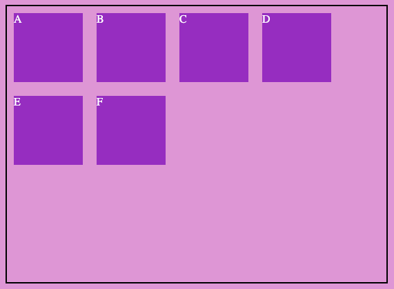

- **flex-end**
    
    Disposición al final del contenedor
    

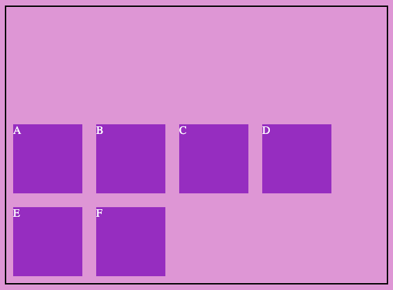

- **center**
    
    Disposición centrado respecto al contenedor
    

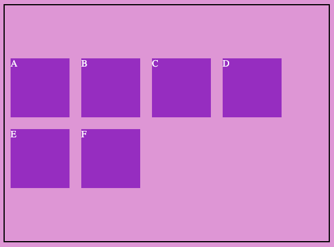

- **stretch**
    
    Ocupa todo el alto del contenedor
    

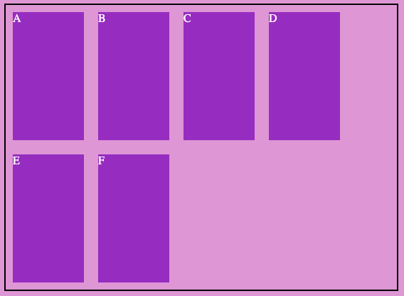

- **space-between**
    
    Da espacio entre las filas
    

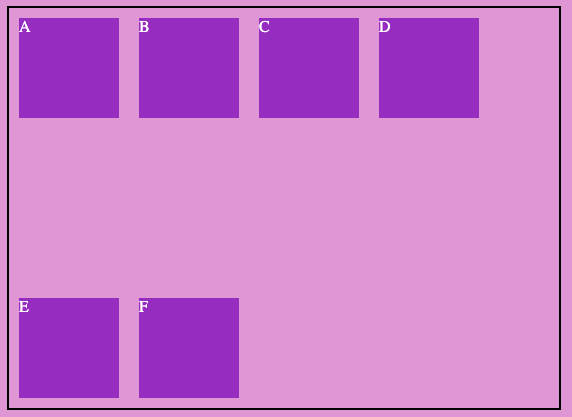

- **space-around**
    
    Distribuye el espacio libre de forma homogénea
    

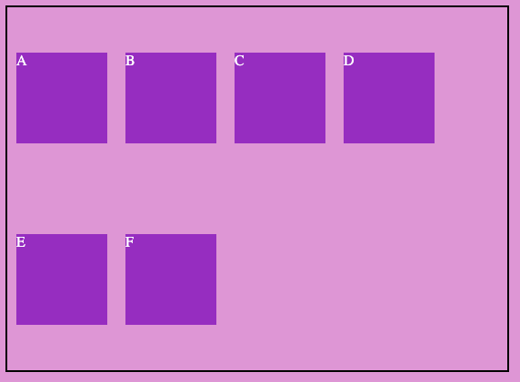