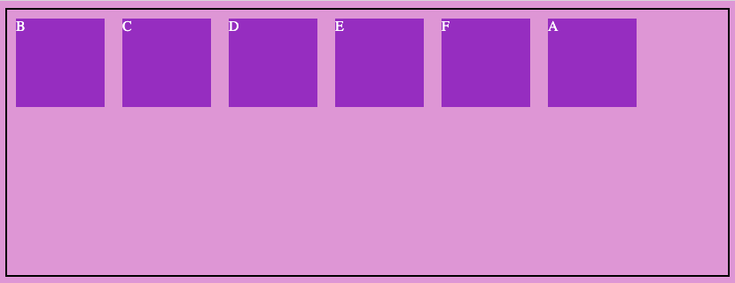
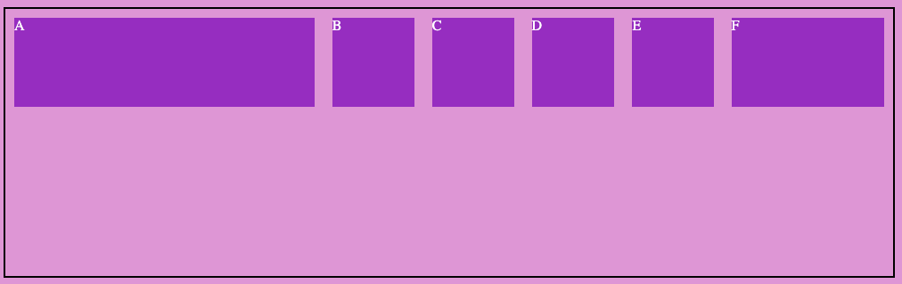
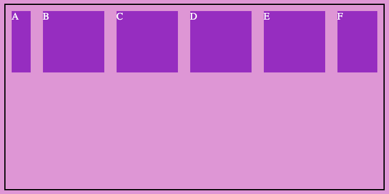
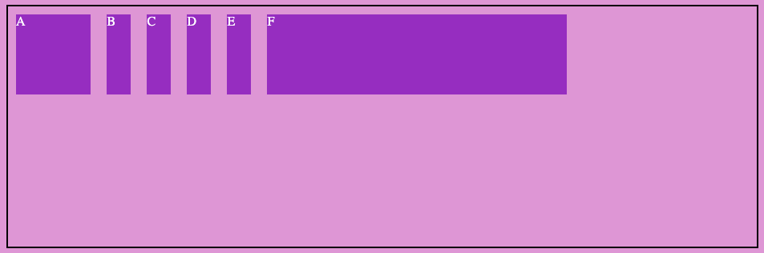
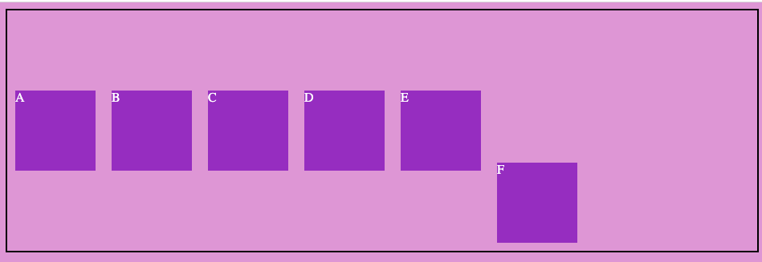

Vamos ahora a entrar a revisar en profundidad cada una de las propiedades que pueden tener nuestros elementos hijos

- order
- flex-grow
- flex-shrink
- flex-basis
- flex
- aling-self

### ORDER

Propiedad que nos sirve para ordenar los elementos dentro del contenedor padre.

  

```css
.flex-item {
    order: 2; /* Por defecto todos los elementos tienen order 0 */
} 
```

  



### FLEX-GROW

Propiedad que indica como crecerá ese elemento dentro del contenedor. Las unidades que admite la propiedad son como proporción.

 

```css
.flex-item {
    flex-grow: 2; /* Por defecto todos los elementos tienen 0 */
} 
```

  

Si por ejemplo, todos los hijos tienen una proporción 1 menos uno de ellos que tiene proporción 2, este último intentará ocupar el doble que cualquiera de los otros.



### FLEX-SHRINK

Propiedad que indica la capacidad de reducir el tamaño del elemento para adaptarse.

 

```css
.flex-item {
    flex-shrink: 2; /* Por defecto todos los elementos tienen 0 */
} 
```



### FLEX-BASIS

Define el tamaño predeterminado de un elemento antes de distribuir el espacio restante. Puede ser una longitud (20%, 10px...) o auto.

Si se establece en 0, el espacio adicional alrededor del contenido no se tiene en cuenta. Si se configura en auto, el espacio adicional se distribuye según su valor de flex-grow.



### FLEX

Es la combinación de flex-grow + flex-shrink + flex-bases en combinación:

 

```css
.flex-item {
    flex: 1 0 auto;  /* flex: flex-grow flex-shrink flex-bases */
}
```

 

### ALIGN-SELF

Es una propiedad que anula align-items para posicionar específicamente ciertos elementos:

 

```css
.flex-item {
    aling-self: flex-end;
}
```

 

