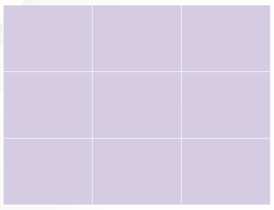
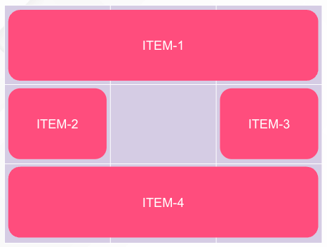

  Vamos a ir viendo las propiedades que podemos aplicar sobre el grid container:

- display
- grid-template (grid-template-columns / grid-template-rows / grid-template-areas)
- gap (row-gap / column-gap)
- place-items (align-items / justify-items)
- place-content (align-content / justify-content)
- grid

### **DISPLAY**

Propiedad utilizada para generar un nuevo contenedor de grid.

```css
.container {
	display: grid | inline-grid;
}
```

- **grid**
    
    Genera un bloque grid
    
- **inline-grid**
    
    Genera un bloque en linea de grid
    

### **GRID-TEMPLATE**

Es una atajo que agrupa grid-template-rows, grid-template-columns y grid-template-areas. Vamos a ir viendo estas propiedades

**[** **grid-template-rows | grid-template-columns ]**

Son dos propiedades que definen las cuadrícula. Los valores más utilizados son los de la longitud del carril.

        



```css
.container{
    display: grid;
    width: 400px;
    height: 400px;
    background-color: pink;
    grid-template-columns: 33% 33% 33%;
    grid-template-rows: 33% 33% 33%;
}
```

**[ grid-area ]**

Esta propiedad no es de gran ayuda a la hora de crear la cuadrícula haciendo referencia a los nombres de áreas especificados con grid-area.

Veamos un ejemplo:



  

```css
.container{
    display: grid;
    width: 400px;
    height: 400px;
    background-color: pink;
    grid-template-columns: 1fr 1fr 1fr;
    grid-template-rows: 1fr 1fr 1fr;
    grid-template-areas:
        "item-1 item-1 item-1"
        "item-2 . item-3"
        "item-4 item-4 item-4";
}

.item-1{
    grid-area: item-1;
    background-color: blue;
}
.item-2{
    grid-area: item-2;
    background-color: yellow;
}
.item-3{
    grid-area: item-3;
    background-color: green;
}
.item-4{
    grid-area: item-4;
    background-color: red;
}
```

 

**[** **grid-template ]**

Grid template areas aglutina estas 3 ultimas propiedades. 

```css
.container {
  grid-template: none | <grid-template-rows> / <grid-template-columns>;
}
```

 

De esta manera, podríamos reducir lo siguiente:

  

```css
/* anterior */
.container{
    grid-template-columns: 1fr 1fr 1fr;
    grid-template-rows: 1fr 1fr 1fr;
    grid-template-areas:
        "item-1 item-1 item-1"
        "item-2 . item-3"
        "item-4 item-4 item-4";
}

/* nuevo */
.container{
	grid-template: "item-1 item-1 item-1" 1fr "item-2 . item-3" 1fr "item-4 item-4 item-4" 1fr/ 1fr 1fr 1fr;
}
```

### **GAP**

Es una atajo que agrupa grid-row-gap y grid-column-gap.

Vamos a ir viendo estas propiedades

**[ grid-row-gap ]  [ grid-column-gap ]**

Hace referencia al tamaño de la línea de la cuadrícula. Si incluimos el siguiente código en el ejemplo en el que estamos trabajando vemos la diferencia:

 

```css
.container{
	column-gap: 4px;
	row-gap: 10px;
}
```

 

**[ gap ]**

Ambas propiedades pueden unirse en la propiedad gap

 

```css
.container{
	gap: 10px 4px;
}
```

 

### **PLACE-ITEMS**

Es una propiedad que engloba **justify-items** y **align-items**.

Estas nos suenan de haberlas trabajado con flex, funcionan igual tomando la posición del item sobre la cuadrícula 

 

```css
.container {
  justify-items: start | end | center | stretch;
	align-items: start | end | center | stretch;
}

/* en una sola propiedad */

.container{
	place-items: start / center /* align-items / justify-items */
```

 

***justify-content** nos ayuda de la misma manera a cuadrar el grid sobre el grid-container.

### GRID

La propiedad GRID agruparía todas las propiedades anteriores, si queréis echarle un ojo a la sintaxis os dejamos la documentación:

> https://css-tricks.com/snippets/css/complete-guide-grid/