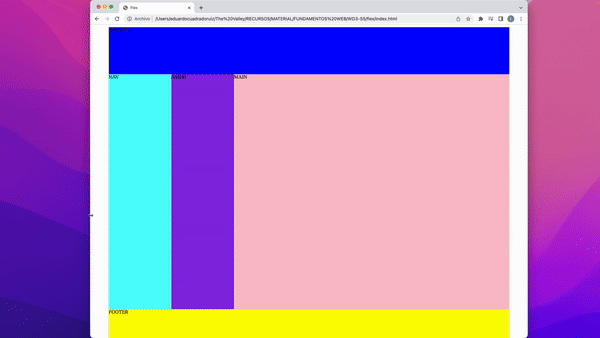

Tras conocer todas las posibilidades que nos da GRID, vamos a realizar un ejercicio el cual nos permitirá crear un layout responsive. Trabajaremos con una estructura web estándar:



```html
<div>
	<header>HEADER</header>
	<nav>NAV</nav>
	<aside>ASIDE</aside>
	<main>MAIN</main>
	<footer>FOOTER</footer>
</div>
```

En este caso el div será el grid-container, le asignamos un tamaño y aplicamos `display:grid`:

```css
*{
    margin:0;
}

div {
    margin: 0 auto;
    max-width: 1280px;
    min-height: 100vh; /* indicamos que mide el 100% de la altura del viewport */
    display: grid;
}
```

Trabajaremos primero la parte movil, aprovechamos también para añadir colores a todas las secciones.

```css
div {
    margin: 0 auto;
    max-width: 1280px;
    min-height: 100vh;
    display: grid;
    grid-template-columns: 100%;
    grid-template-rows: 
        150px
        100px        
        100px
        4fr /* utilizamos fracciones como unidad de medida de Grid */
        150px;

}

header{
    background-color: blue;
}

nav{
    background-color: aqua;
}

aside{
    background-color: blueviolet;
}

main{
    background-color: pink;
}

footer{
    background-color: yellow;
}
```

Llega el turno de ir adaptando este diseño a los diferentes tamaños de pantalla y reordenar, para ello utilizaremos las propiedades de `grid-area` y `grid-templates-areas`.

Primero asignamos a cada sección un nombre de área y luego creamos el template:

```css
div {
    margin: 0 auto;
    max-width: 1280px;
    min-height: 100vh;
    display: grid;

    grid-template-columns: 100%;
    grid-template-rows: 
        150px
        100px        
        100px
        4fr
        100px;
    grid-template-areas:
        "tv-header"
        "tv-nav"
        "tv-main"
        "tv-aside"
        "tv-footer";

}

header{
    grid-area: tv-header;
    background-color: blue;
}

nav{
    grid-area: tv-nav;
    background-color: aqua;
}

aside{
    grid-area: tv-aside;
    background-color: blueviolet;
}

main{
    grid-area: tv-main;
    background-color: pink;
}

footer{
    grid-area: tv-footer;
    background-color: yellow;
}
```

Para realizar el formato tablet crearemos una media query y adaptaremos el grid-area

```css
@media screen and (min-width:768px){
    div{
        grid-template-columns: 200px 1fr 1fr; /* aquí ya tenemos 3 columnas */
        grid-template-rows: 
            150px
            100px
            1fr
            100px;
	/* indicamos con que sección ocupamos cada una de las cuadriculas */
        grid-template-areas:
        "tv-header tv-header tv-header"
        "tv-nav tv-nav tv-nav"
        "tv-aside tv-main tv-main"
        "tv-footer tv-footer tv-footer";
    }
}
```

Lo mismo para tamaño desktop:

```css
@media screen and (min-width:1024px){
    div{
        grid-template-columns: 200px 200px 1fr;
        grid-template-rows: 
            150px
            1fr
            100px;
        grid-template-areas:
            "tv-header tv-header tv-header"
            "tv-nav tv-aside tv-main "
            "tv-footer tv-footer tv-footer";
    }
}
```

**repeat()**

Aprovechando el ejercicio podemos ver los siguientes conceptos del método GRID que nos permitirán llevar nuestros layouts al siguiente nivel.

 

```css
/* tenemos esto */
grid-template-columns: 1fr 1fr 1fr

/* podemos cambiarlo por esto */
grid-template-columns: repeat(3, 1fr);
```

**auto-fit()**

  En caso de que queramos trabajar con un número de elementos dinámicos podemos utilizar 

 

```css
grid-template-columns: repeat(auto-fit, 100px);
```

  

**minmax()**

Si queremos incluso hacer dinámico el tamaño, con la función minmax() podemos indicar el tamaño mínimo y máximo de nuestras columnas y filas.

 

```css
grid-template-columns: repeat(auto-fit, minmax(100px, 1fr));
```
