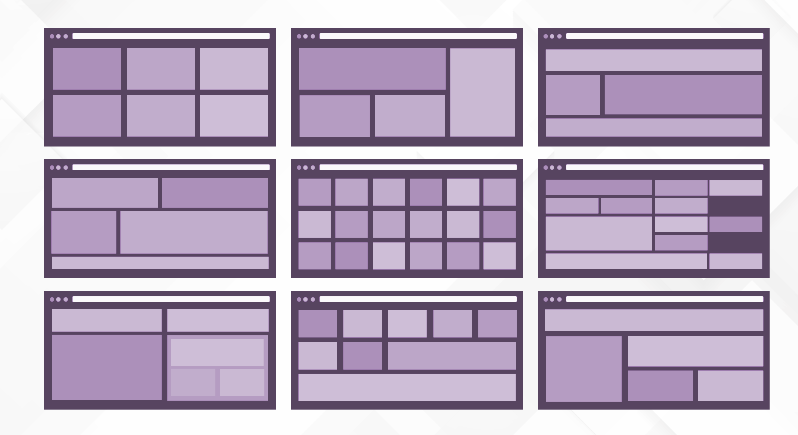
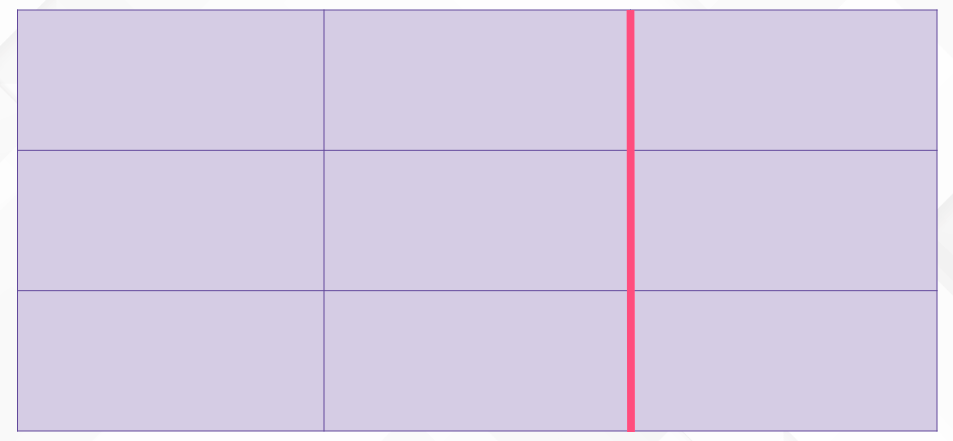
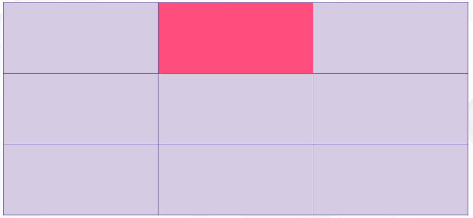
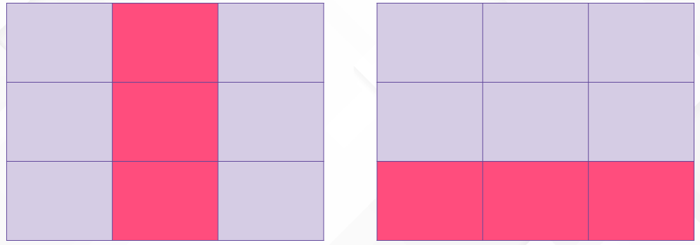
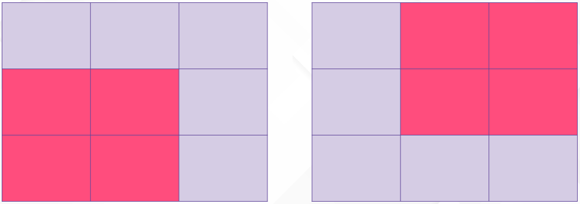

GRID es por así decirlo, el primer módulo de CSS que se ha creado con el objetivo de resolver los problemas de diseño que existían a la hora de establecer un diseño web (antes usábamos tablas, elementos flotantes…)

GRID se basa en un diseño bidireccional basado en cuadrículas, a partir de esto, los elementos pueden posicionarse en esas cuadrículas o en áreas personalizadas que se definan.



Para empezar a entender esto de las cuadrículas vamos a ver unos conceptos básicos.

## CONCEPTOS BÁSICOS

Es importante entender cada uno de estos conceptos ya que son entre sí muy similares y confundirlos nos va a llevar a errores.

**GRID CONTAINER**

Es el padre directo de todos los elementos del grid. 

 

```html
<div class="grid-contanier">
   <div class="grid-item"> </div>
   <div class="grid-item"> </div>
   <div class="grid-item"> </div>
 </div>
```

 

**GRID ITEM**

Los items del grid serán todos los elementos directamente hijos del grid-contanier. En el caso del ejemplo, estos 3 elementos.

```html
<div class="grid-item"> </div>
<div class="grid-item"> </div>
<div class="grid-item"> </div>
```

 

**GRID LINE**

Líneas divisorias que componen la estructura de la cuadrícula, y que son tanto horizontales como verticales



**GRID CELL**

La unidad de cuadrícula. Es el espacio entre dos lineas de filas adyacentes y dos líneas de columnas adyacentes.



**GRID TRACK**

El espacio entre dos líneas de cuadrícula (puede ser horizontal o vertical)



**GRID ÁREA**

El espacio entre 4 líneas.


